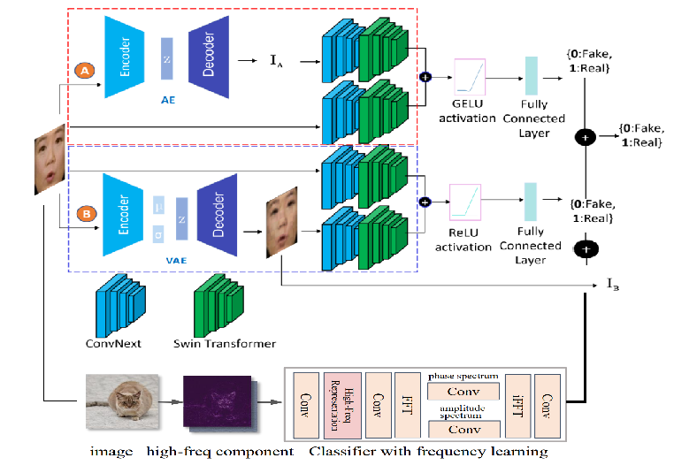
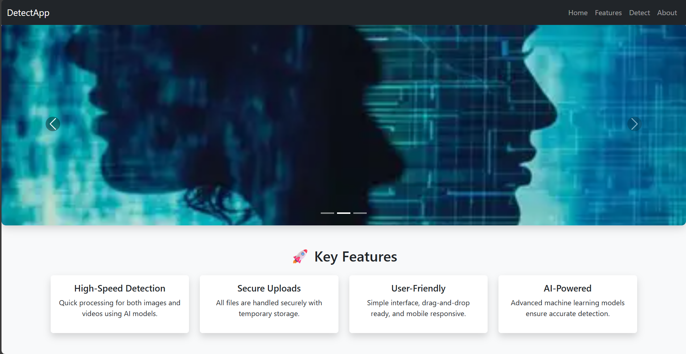
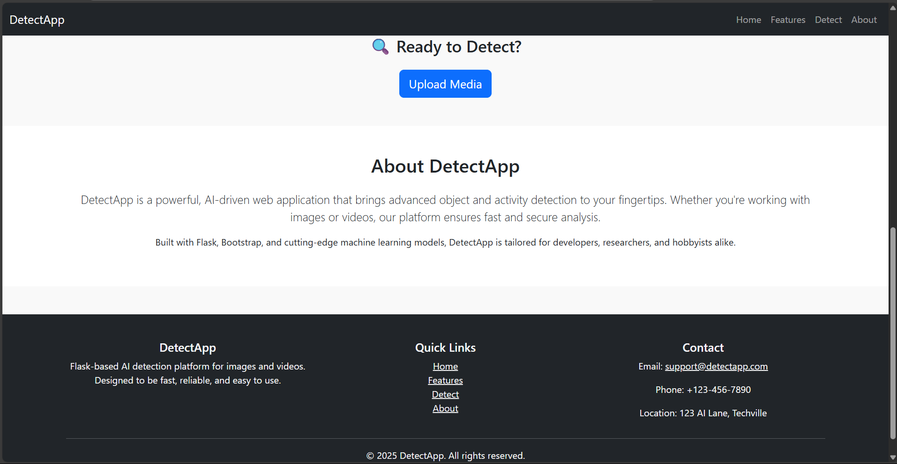
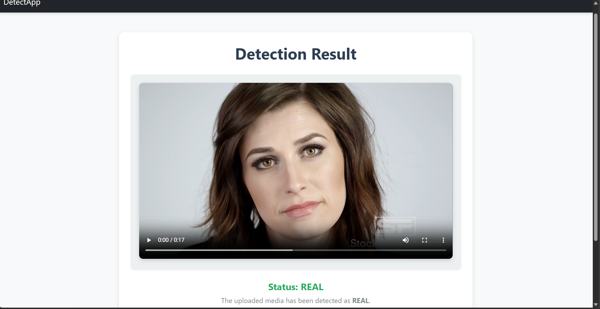
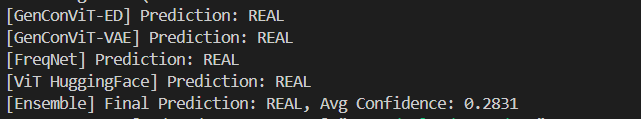

# 🧠 Deepfake Detection Using GenConViT and FreqNet with Ensemble-Based Web Inference

> Ensemble-based deepfake detection system powered by GenConViT, FreqNet, and Vision Transformer. Includes a web-based inference interface using Flask for real-time image/video verification.

---

## 📸 Project Overview

The system integrates:
- **GenConViT Autoencoder + VAE** (Generative Convolutional Vision Transformer)
- **FreqNet** (Frequency-Aware CNN)
- **ViT** (Vision Transformer from HuggingFace)

It combines **spatial**, **frequency**, and **latent representation** learning to classify media as `REAL` or `FAKE`.

---

## 🖼️ System Architecture

### 📊 Fig. 1 – Architecture Diagram


---

## 🌐 DetectApp Web Interface

DetectApp is a Flask-based frontend allowing users to upload images or videos and view authenticity predictions.

### 🧭 Fig. 2 – Landing Page with Carousel and Features


### 📤 Fig. 3 – Upload and About Section


### 🎯 Fig. 4 – Result Page with Prediction Outcome


### 🧮 Fig. 5 – Individual Model Predictions


---

## 🚀 Features

- ✅ Multi-model inference (GenConViT, FreqNet, ViT)
- 🖼️ Image and Video support (`.jpg`, `.png`, `.mp4`, `.avi`)
- ⚡ Fast frame-level detection
- 🔐 Secure file handling
- 📱 Mobile-responsive web interface

---

## 🛠️ Installation Instructions

### 2. Install Dependencies

Create a virtual environment and install all required dependencies:

```bash
# Create a virtual environment
python -m venv venv

# Activate the environment
# On macOS/Linux:
source venv/bin/activate

# On Windows:
venv\Scripts\activate

# Install dependencies
pip install -r requirements.txt
```

---

### 4. Run the Web App

After installing the dependencies and activating the virtual environment:

```bash
python app.py
```

The app will be available at: [http://127.0.0.1:5000](http://127.0.0.1:5000)

---

## 📂 Folder Structure

```
.
├── app.py
├── models/
│   ├── genconvit_ae.pth
│   ├── genconvit_vae.pth
│   └── freqnet.pth
├── static/uploads/
├── templates/
│   ├── index.html
│   ├── upload.html
│   └── result.html
├── assets/
│   ├── fig1_architecture.png
│   ├── fig2_landing.png
│   ├── fig3_upload_about.png
│   ├── fig4_result.png
│   └── fig5_model_predictions.png
├── requirements.txt
└── README.md
```

---

## 📊 Dataset Used

### 🔊 Deepfake-TIMIT (Video-Based)

- **Total Videos**: 10,240  
  - 320 real  
  - 9,920 deepfakes  
- **Frame Rate**: 25 frames per second  
- **Video Duration**: ~3 seconds each  
- **Total Image Frames**: ~768,000 frames

---

## ✨ Results and Evaluation

| Model       | Dataset Scope            | Accuracy     |
|-------------|---------------------------|--------------|
| GenConViT   | In-domain (video)         | ~98%         |
| FreqNet     | Cross-GAN (17 generators) | 92.8% (mean) |
| ViT         | Independent image dataset | ~70%         |

---

## 🧠 Model Inference Summary

| Model           | Input Type | Method             | Output      |
|------------------|------------|--------------------|-------------|
| GenConViT-AE     | Image/Video | Reconstruction     | Real/Fake   |
| GenConViT-VAE    | Image/Video | Latent Analysis    | Real/Fake   |
| FreqNet          | Image/Video | FFT-based Learning | Real/Fake   |
| ViT              | Image       | Transformer-Based  | Real/Fake   |

### Ensemble Voting
- Majority voting across 4 models.
- Confidence is averaged from all model outputs.

---

## 🔮 Future Enhancements

- ⏱ Replace subprocess-based inference with native PyTorch pipeline
- 🎥 Extend ViT to process video frames
- 🎞 Add 3D-CNN or temporal transformer for sequence consistency
- 🧠 Use Grad-CAM / saliency maps for interpretability

---

## 📄 License

This project is open-source and licensed under the MIT License.

---

## 👨‍💻 Authors

- Prince Raj  
- Sumit Dohan  
- Jatin Mudiraj  
- Aksshay Mathew P  
_CSE, IIT Ropar_

---

## 🌍 Acknowledgements

- [GenConViT Paper](https://arxiv.org/abs/2307.07036)  
- [FreqNet Paper](https://arxiv.org/abs/2403.07240)  
- [Hugging Face ViT Model](https://huggingface.co/google/vit-base-patch16-224-in21k)
